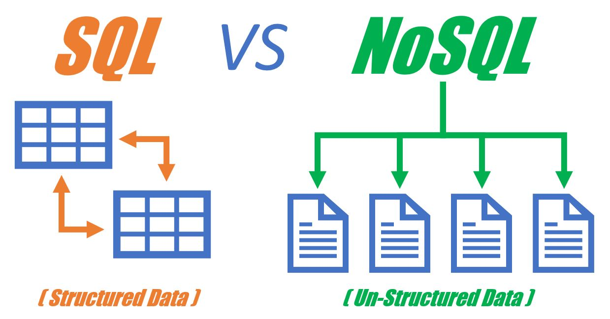

# Day01

# 스키마란?

- MySQL

DB서버를 열어주고 관리해주는 프로그램이자 툴

- Table

Data들을 담은 표

- Schema

연관된 데이터들을 그룹핑

> 데이터베이스의 **구조**와 **제약조건에** 관해 전반적인 명세를 기술한 것
> 

> 개체의 특성을 나타내는 속성(Attribute)과 속성들의 집합으로 이루어진 개체(Entity),개체 사이에 존재하는 관계(Relation)에 대한 정의와이들이 유지해야 할 제약조건들을 기술한 것
> 

# SQL vs NoSQL

1. SQL databases are relational, NoSQL databases are non-relational.
2. SQL databases use structured query language and have a predefined schema. NoSQL databases have dynamic schemas for unstructured data.
3. SQL databases are vertically scalable, while NoSQL databases are horizontally scalable.
4. SQL databases are table-based, while NoSQL databases are document, key-value, graph, or wide-column stores.
5. SQL databases are better for multi-row transactions, while NoSQL is better for unstructured data like documents or JSON.

# Reference

[https://www.bmc.com/blogs/sql-vs-nosql/#:~:text=In contrast%2C NoSQL databases are,or constantly evolving data sets](https://www.bmc.com/blogs/sql-vs-nosql/#:~:text=In%20contrast%2C%20NoSQL%20databases%20are,or%20constantly%20evolving%20data%20sets).